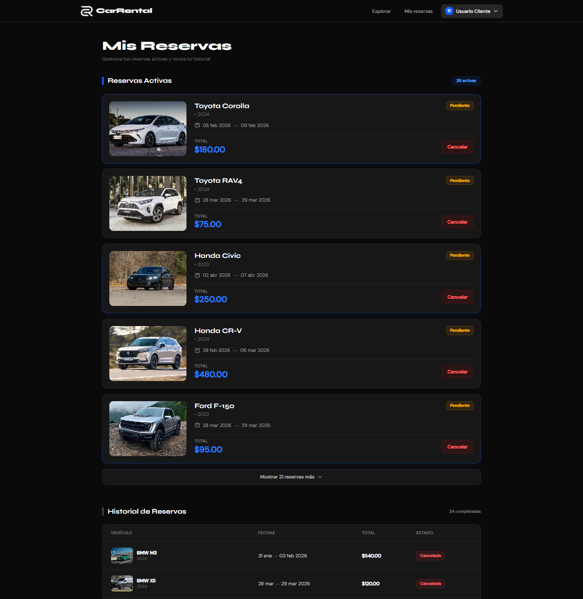
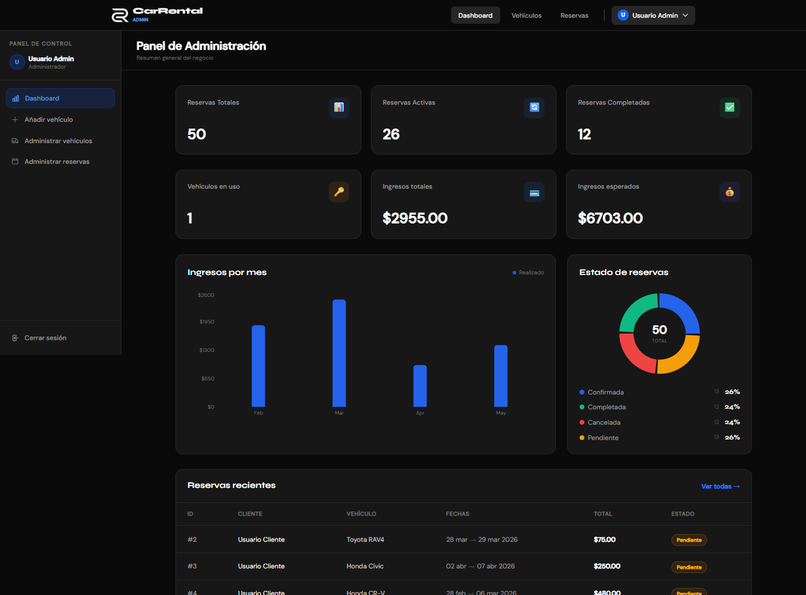

# CarRental 🚗

Aplicación web fullstack para la gestión de alquiler de vehículos. Permite a los usuarios explorar autos, realizar reservas y a los administradores gestionar el negocio mediante un panel con estadísticas en tiempo real.

---

## 🌐 Demo

Frontend: https://carrental-frontend-wfto-125h40yvc-deiver221s-projects.vercel.app/
Backend API: https://carrental-backend-rsan.onrender.com

### Credenciales de prueba

**Admin**

* Email: [admin@example.com]
* Password: password

**Usuario**

* Email: [cliente@example.com]
* Password: password

---

## ⚙️ Tecnologías

### Frontend

* React
* Vite
* TailwindCSS
* Recharts

### Backend

* Laravel
* PostgreSQL
* API REST
* Autenticación con JWT

### Deploy

* Vercel (Frontend)
* Render (Backend)

---

## 🚀 Funcionalidades

### Usuario

* Registro e inicio de sesión
* Búsqueda de vehículos por nombre o marca (insensible a mayúsculas/minúsculas)
* Filtros por categoría y marca
* Visualización de detalles del vehículo
* Sistema de reservas con validación de disponibilidad por fechas

### Administrador

* Panel administrativo con métricas del negocio
* Visualización de ingresos mensuales mediante gráficos
* Gestión completa de vehículos:

  * Crear, editar, eliminar
  * Activar / desactivar publicaciones
* Gestión de reservas de usuarios

---

## 🧠 Arquitectura

* Aplicación desacoplada (frontend y backend independientes)
* Comunicación mediante API REST
* Autenticación basada en tokens JWT
* Base de datos PostgreSQL en la nube
* Deploy en servicios separados para frontend y backend

---

## 🛠️ Instalación local

### Frontend

git clone https://github.com/TU-USUARIO/carrental-frontend
cd carrental-frontend
npm install
npm run dev

### Variables de entorno

VITE_API_URL=http://localhost:8000

---

## ⚠️ Notas

* La base de datos se reinicia en cada despliegue para mantener datos de prueba consistentes.
* Las imágenes de los vehículos se cargan desde URLs externas.
* El backend está desplegado en Render y puede tardar unos segundos en responder si está inactivo (cold start).
* Algunas funcionalidades dependen de datos generados automáticamente mediante seeders.

---

## 📸 Screenshots

---

## 📌 Autor

**Deiverrr**
GitHub: https://github.com/Deiver221
